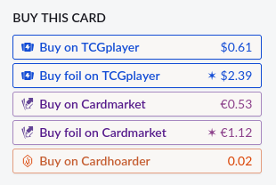
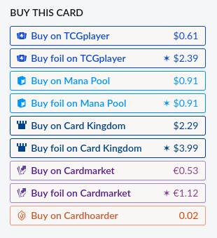
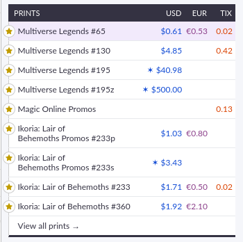
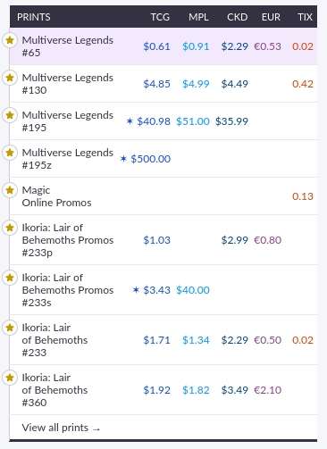

  <picture>
    <source srcset="src/icons/icon-white.svg" media="(prefers-color-scheme: dark)">
    <source srcset="src/icons/icon-black.svg" media="(prefers-color-scheme: light)">
    
  </picture>

# ScryBuy

A Firefox/Chrome extension that adds store purchase links and pricing information to [Scryfall](https://scryfall.com) card pages.

<table align="center" border="0" cellspacing="0" cellpadding="0" style="border: none;">
  <tr>
    <td style="border: none;"></td>
    <td align="center" style="border: none;">➡</td>
    <td style="border: none;"></td>
  </tr>
  <tr>
    <td style="border: none;"></td>
    <td align="center" style="border: none;">➡</td>
    <td style="border: none;"></td>
  </tr>
</table>

## Features

- Adds purchase links for:
  - [Mana Pool](https://manapool.com)
  - [Card Kingdom](https://www.cardkingdom.com)
- Allows hiding individual marketplaces, including:
  - TCGplayer
  - Cardmarket
  - Cardhoarder
- Shows price for both regular and foil versions.
- Shows price on store buttons and in the prints section.
